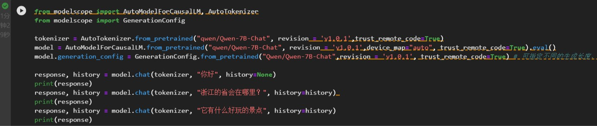
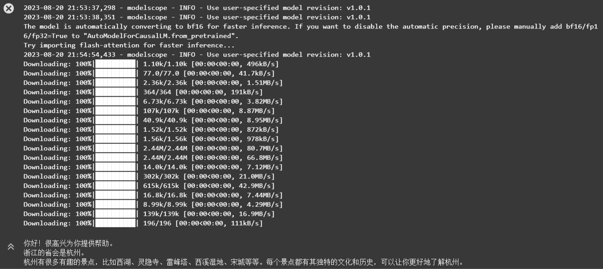
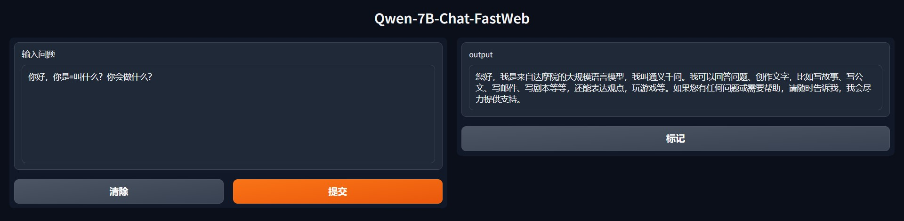

# Qwen-7B-Chat-FastWeb
基于ModelScope社区开源Qwen-7B-Chat体验程序修改的web版本，以方便快速体验。  
ModelScope社区提供了开源模型Qwen-7B的快速体验脚本，脚本和运行效果如下所示：  
<div align="center">
  
</div>
<div align="center">
  
</div>
但是脚本本身只有命令行的输出，这里给脚本加了一个基于gradio简单用法做成的的web界面，运行后会提供一个web界面，体验感应该会好一点。  

运行时先拉取或者下载项目里的文件，然后安装依赖： 

```bash
pip install -r requirements.txt
```

然后用python运行主程序即可： 

```bash
python qwen_web,py
```

程序会自动从ModelScope社区拉取与上方脚本一致的模型并运行，如下图所示： 
<div align="center">
  
</div>
<div align="center">
  
</div>
经测试，在阿里云上模型的下载速度非常快，V100的显卡也不会爆显存，不过这里的版本号似乎是最小的一个，如果想体验完整的程序，还是得到ModelScope页面下载Qwen最新的模型，去Qwen官方的GitHub页下载官方的体验demo。

[Qwen-7B-Chat的ModelScope地址](https://modelscope.cn/models/qwen/Qwen-7B-Chat/summary)
