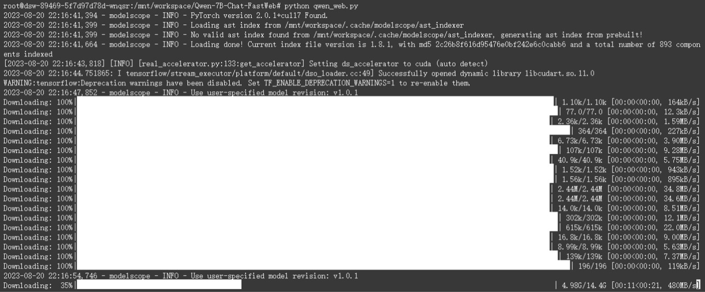

# 通意千问 Qwen-7B-FastWeb
<p align="center">
    <a href="https://space.bilibili.com/41660208" target="_blank">BiliBili</a>
</p>
基于ModelScope社区开源的通意千问Qwen-7B-Chat体验程序修改的Web版本，以方便快速部署体验。

ModelScope社区提供了开源模型Qwen-7B的快速体验脚本，脚本和运行效果如下所示：

<div align="center">
  
</div>
<div align="center">
  
</div>
但是脚本本身只有命令行的输出，这里给脚本加了一个基于Gradio简单用法做成的的Web界面，运行后会提供一个Web界面，体验感应该会好一点。

运行时先拉取或下载仓库里的文件，然后安装依赖库： 

```bash
pip install -r requirements.txt
```

然后用python运行主程序即可： 

```bash
python Qwen_demo.py
```

程序会自动从ModelScope社区拉取与上方脚本一致的模型并运行，如下图所示： 
<div align="center">
  
</div>
<div align="center">
  
</div>
经测试，在阿里云服务器上模型的下载速度非常快，V100的显卡也不会爆显存，不过这里的版本号似乎是最小的一个，如果想体验完整的程序，还是得到Qwen的ModelScope页面下载通意千问最新的模型，去Qwen官方的GitHub页下载通意千问官方的体验Demo。

相关链接：

[Qwen-7B-Chat的🤖ModelScope地址](https://modelscope.cn/models/qwen/Qwen-7B-Chat/summary)

[Qwen-7B的📃GitHub地址](https://github.com/QwenLM/Qwen-7B)

[Qwen-7B-Chat的🤗HuggingFace地址](https://huggingface.co/Qwen/Qwen-7B-Chat)
